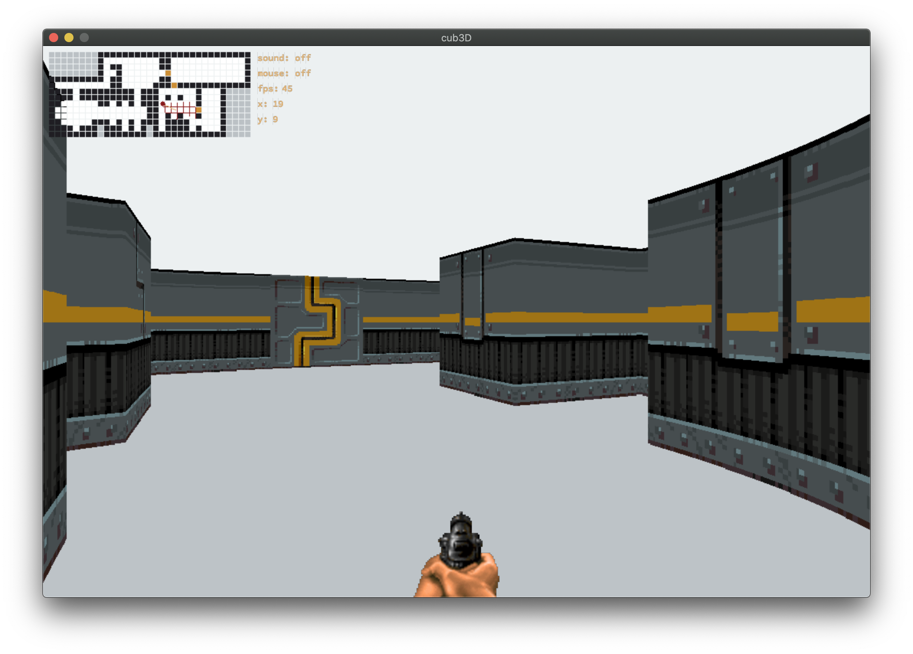

<h1 align="center" style="text-align: center">
     </br>
    Project n°9 - cub3d
    <h4 align="center" style="width: 50%; margin: 2rem auto; font-weight: normal; text-align: center"> 
     This project is inspired by the world-famous eponymous 90's game, which was the first FPS ever. It will enable you to explore ray-casting. Your goal will be to make a dynamic view inside a maze, in which you'll have to find your way.
    </h4>
</h1>

<a href="https://little-martian.itch.io/retro-texture-pack">
  <p align="center">
    
  </p`>
  <p align="center">sprites: https://little-martian.itch.io/retro-texture-pack</p>
</a>

## Goals

- The program must take as a first argument a scene description file with the .cub
  extension.
- Display different wall textures (the choice is yours) that vary depending on which
  side the wall is facing (North, South, East, West).
- The program must be able to set the floor and ceiling colors to two different ones.
- The program displays the image in a window and respects the following rules:
  - The left and right arrow keys of the keyboard must allow you to look left and
  right in the maze.
  - The W, A, S, and D keys must allow you to move the point of view through
  the maze.
  - Pressing ESC must close the window and quit the program cleanly.
  - Clicking on the red cross on the window’s frame must close the window and
  quit the program cleanly.

## Steps
- [x] Parse the map:
  - Read the map with gnl and save
    - Map content
    - Textures
    - Floor & Ceilling color
  - Fill all the empty space by a ``1`` to fix the map shape and avoid issue for wall creation.
- [x] Use a minimap as reference:
  - Draw a minimap to the window (Wall, Ground, Empty space, Door && player) (BONUS)
  - Add player move && update position within the minimap scale
  - Catch Horizontal && Vertical rays from player position with [raycasting](https://en.wikipedia.org/wiki/Ray_casting) concept
  - Detect wall and save the shortest distance from the player position
  - Create wall collision detection (BONUS)
- [x] Draw 3D World:
  - Scale up the rays peviously catch and draw wall
  - Add side wall detection regarding player angle (N,S,E,W)
  - Draw floor && ceilling
  - Fix fisheye effect
- [x] Display sprites:
  - Put sprites to wall pixel by pixel
- [x] Player interaction (BONUS):
  - Open/close door
  - Use weapon
  - Minimap
  - Mouse movement
  - Collision

## How to play

- Move: ``w a s d``
- Camera angle: ``left/right arrow key`` or ``mouse``
- on/off mouse pointer: ``p``
- on/off sound: ``v``
- Show/hide minimap: ``m``
- Show/hide weapon: ``k``

## Run the project

```bash
git clone https://github.com/MarJC5/cub3d
cd cub3d
make run
```

Enjoy :^)
  
## Ressources
  - [3DSage](https://www.youtube.com/c/3DSage/featured)
  - [lodev](https://lodev.org/cgtutor/raycasting.html)
